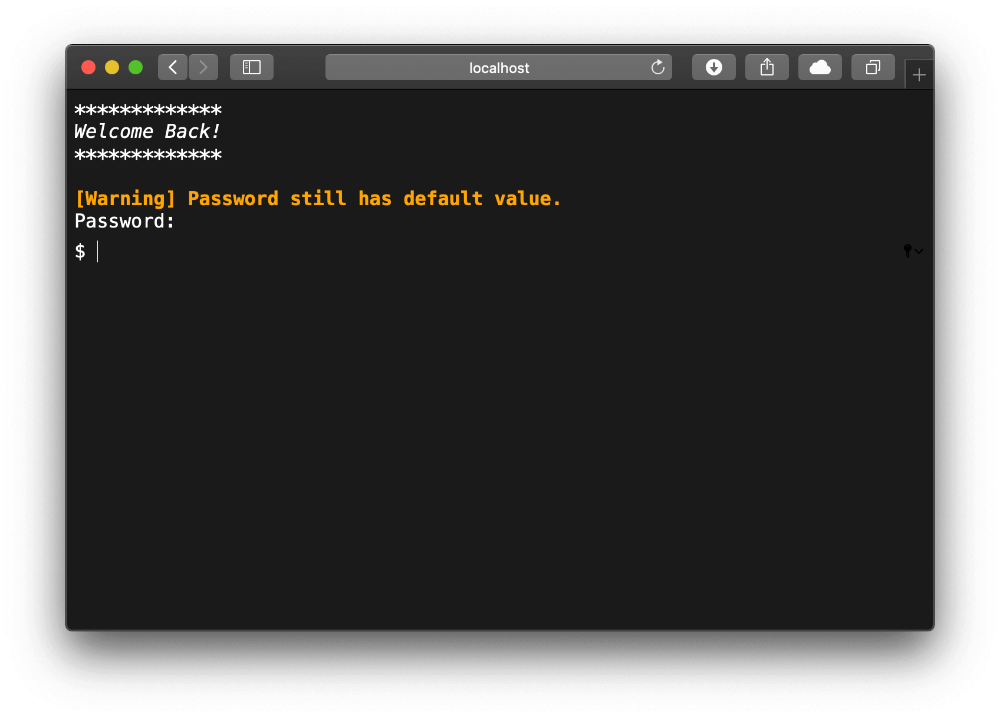
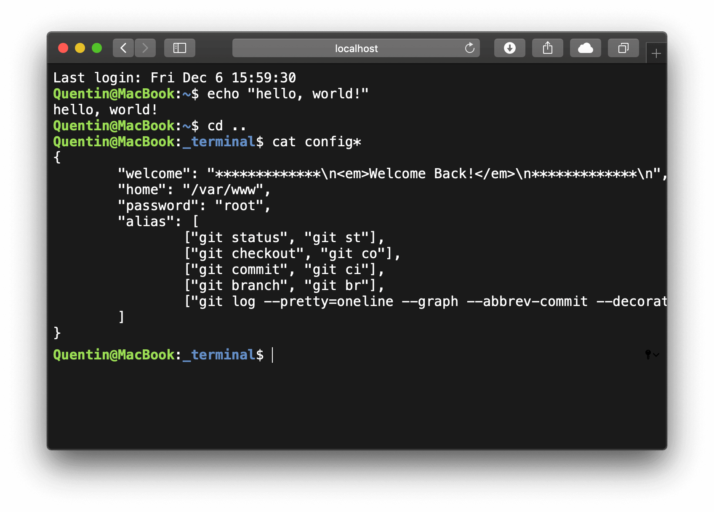

PHP Terminal Emulator
=====================

Standalone PHP terminal emulator.

Useful when host doesn't provide SSH access.

Installation
------------

1. Download the source files.
   ```sh
   git clone -–depth 1 https://github.com/qrichert/_terminal.git
   ```
2. Make sure your domain points to the `public` folder (web root).
3. Done.

Interface
---------

<p align="center">
    <a href="#" target="_blank">
        
    </a>
</p>

<p align="center">
    <a href="#" target="_blank">
        
    </a>
</p>
